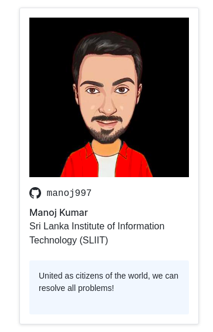

Hello! 😃 Myself **Manoj Kumar Dharmaraja**. Welcome & Great to see you visiting my profile. Take a moment to look at the good work I've done.

### Visitors since this README created :

 

# 🔥 [See me on GitHub Class of 2021 Yearbook](https://education.github.com/graduation/yearbook?sort=az&page=48&search=manoj997#manoj997)

 

# 📜 **About me...**

🏫 I'm an Alumni of [Bambalapitiya Hindu College](https://www.hcc.lk)

👨‍🎓 Graduate at [Sri Lanka Institute of Information Technology](https://www.sliit.lk/) (SLIIT)

👩‍💻 Software Engineer at [IFS](https://www.ifs.com/lk/)

🚴‍♀️ Love for cycling

💖 and a proud Sri Lankan! 🇱🇰

🌏 See more about myself at [my website](https://manoj-kumar.me)!

🚗 Oh! and I'm an Audi fanboy

 

## ✉️ **Reach Me via...**
 

 

### Here's a joke for you!

## 🧑🏻‍💻 **Tech Stack**

#### Programming

#### ML & AI

#### Database

#### Frameworks & Technologies

#### Cloud

#### Issue Tracking, VCS & CI / CD

#### Tools and OS

### 📖 **Currently I'm Learning...**

## 📰 **My Blogs** (in Progress...)

### 👣 Travel Blogs & Vlogs (Coming soon!)

## 📦 **Repositories**

 😎 My profile 👉 [Manoj Kumar](https://github.com/polroti) contains the work that I've done.

 🏢 My Organization profile 👉 [Manbran](https://github.com/manobran) contains the work that I've done with a team of contributors. (College Projects)

### 📖 The organization for the stuff I learn like tutorials etc. is 👉 [My Learning](https://github.com/manoj-learning)

 

## 📊 **Stats...**

<!--  -->

### GitHub Trophies 😜

### Streak 🔥

### Holopin Badges 😎

test